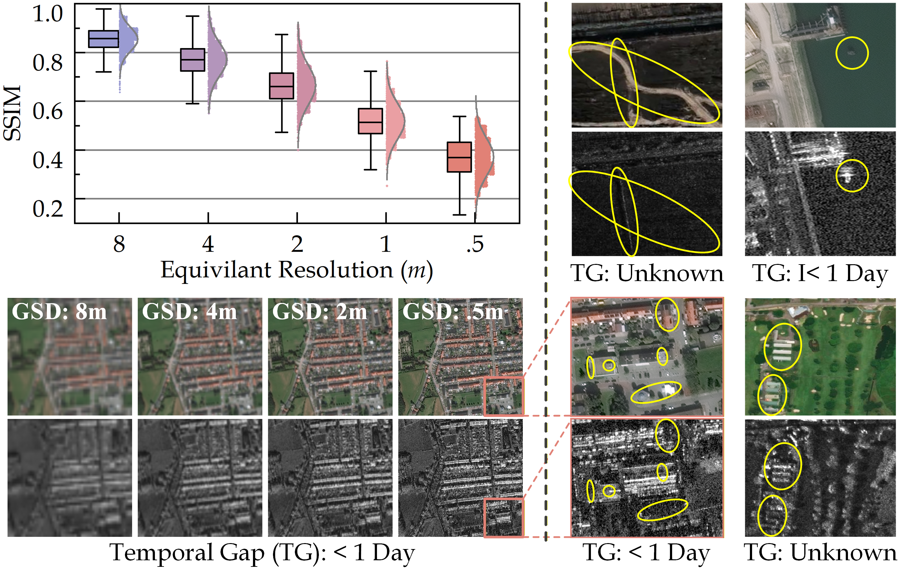
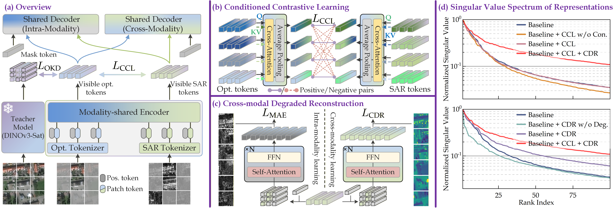
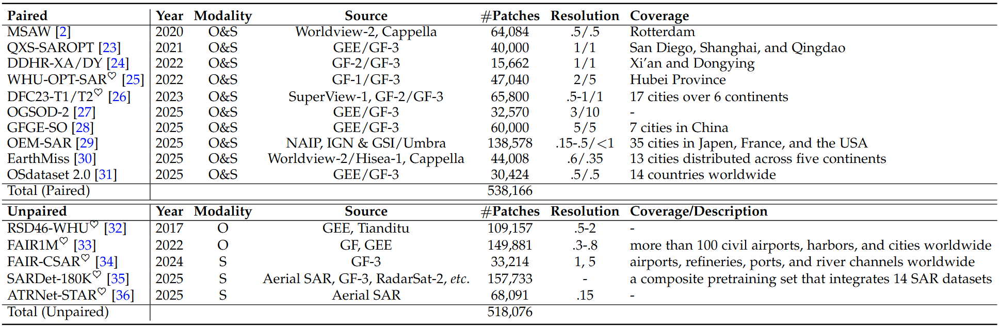
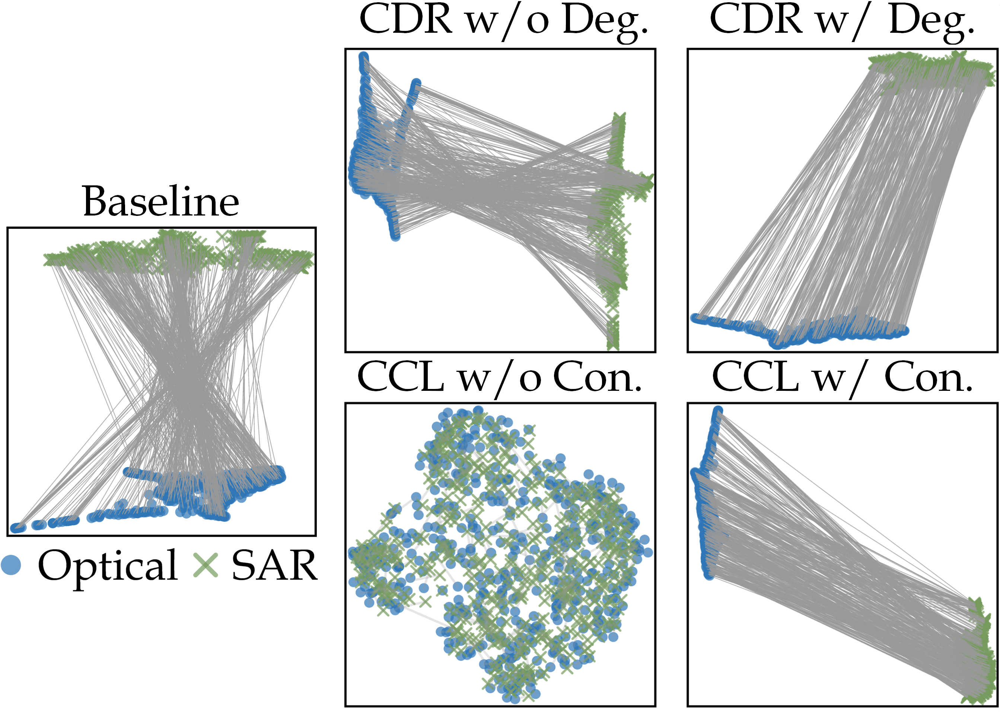
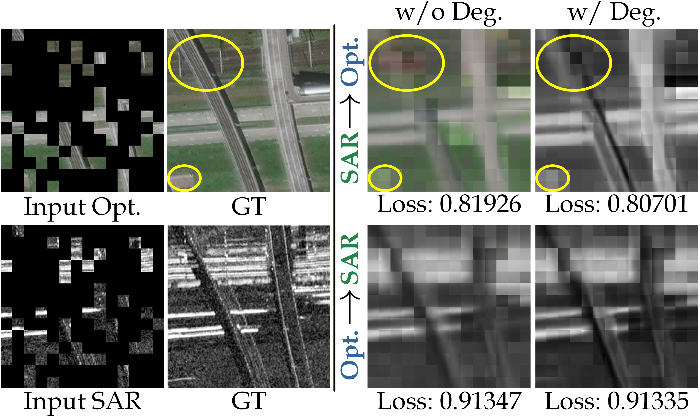
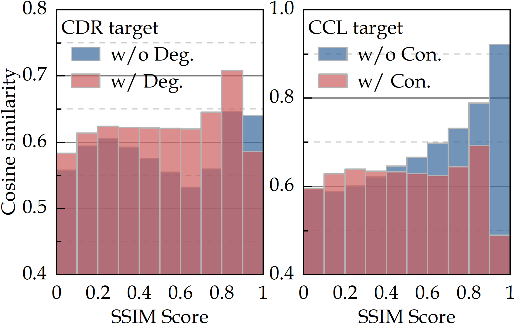
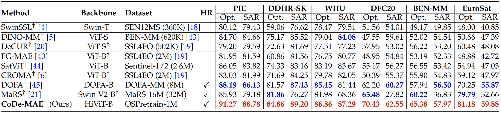
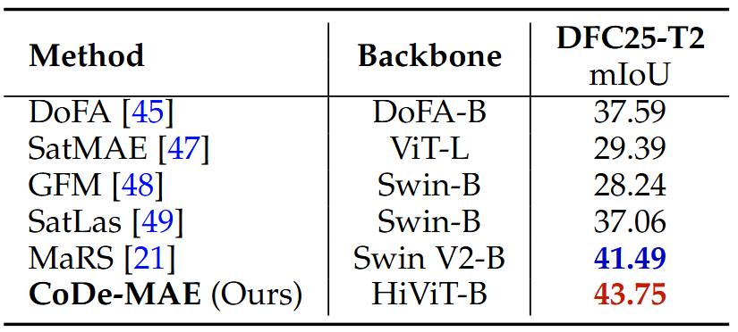
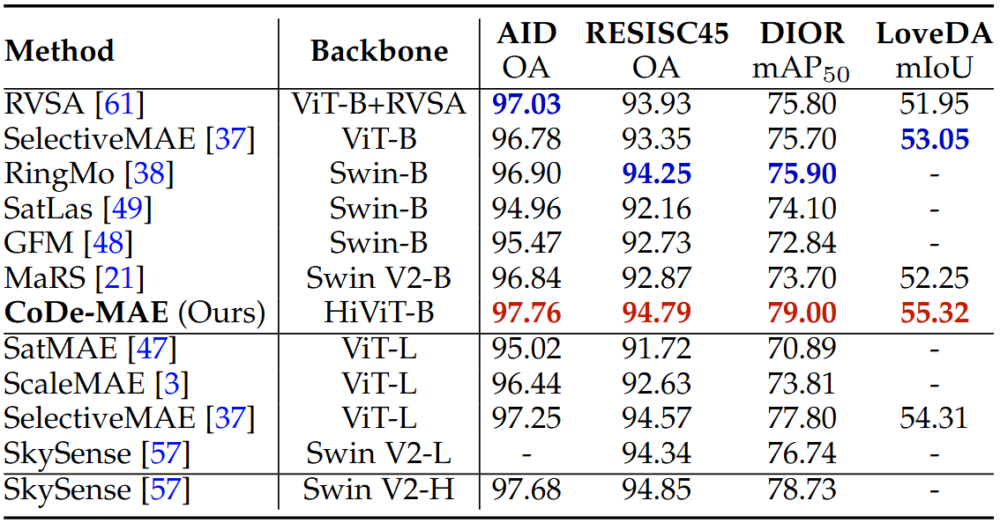
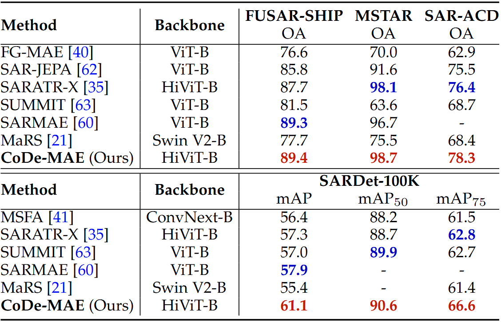

<h1 align="center"> Better with Less: Tackling High-Resolution Optical-SAR Image Joint Pretraining via Conditioned and Degraded Masked Autoencoder </h1> 
<h5 align="center"><em> Bowen Peng, Yongxiang Liu, Jie Zhou, Xiaodong Chen, Xiaogang Yu, Li Liu </em></h5>

<p align="center">
    <a href="#motivation">Motivation</a> |
    <a href="#code-mae">CoDe-MAE</a> |
    <a href="#ospretrain-1m">OSPretrain-1M</a> |
    <a href="#analysis">Analysis</a> |
    <a href="#main-results">Results</a> |
    <a href="#usage-and-resource">Usage&Resources</a> |
    <a href="#license">License</a> |
    <a href="#acknowledgements">Acknowledgements</a> 
</p >
<p align="center">
    <a href="https://arxiv.org/abs/2410.13891"></a>
    <a href="https://pan.baidu.com/s/1MNFYW0sU5Nkla67Aw0EL3g?pwd=vkpg"></a>
</p>

## Motivation

Geospatially registered optical and SAR image pairs are pivotal for optical-SAR joint representation learning/pretraining. Existing methods mainly focus on medium-resolution (MR) imagery like Sentinel-1/2, and rely on contrastive alignment objective (explicit), e.g., CROMA and SwinSSL, or cross-modal masked image modeling (implicit), e.g., msGFM. However, high-resolution (HR) images are essential for better, fine-grained understanding of Earth. These alignment strategies fall in the InfoMin trap, discard modality-unique specifics/physics.


<p align="center">
  
</p>
<div align="center">
Figure 1: Our motivation. Optical and SAR sensors observe the Earth through fundamentally distinct physical mechanisms. This inherent modality heterogeneity, quantified here by the Structural Similarity (SSIM) between image pairs, drastically amplifies at finer spatial scales. The equivalent resolution starts from the original 0.5m ground sample distance (GSD) provided by MSAW dataset, with coarser scales generated via Gaussian Pyramid downsampling following Scale-MAE. For SAR imagery, these scales represent the resampled pixel spacing consistent with the optical grids.
</div>


## CoDe-MAE
<p align="center">
  
</p>
<div align="center">
Figure 2: Overview of CoDe-MAE.
</div>

To instruct the model to learn better modality synergy, i.e., better understanding towards the inter-modal homogeneity and intra-modal heterogeneity, we propose Conditioned and Degraded MAE (CoDe-MAE). Anchored by optical knowledge distillation and a shared architecture to establish a robust semantic baseline, CoDe-MAE shifts from conventional rigid alignment to a paradigm of better synergy with less alignment. To bridge the severe heterogeneity in HR optical-SAR imagery, it introduces two synergistic mechanisms: (b) Conditioned Contrastive Learning (CCL) that selectively aligns shared semantics via cross-attention without over-constraining the original representations and (c) Cross-modal Degraded Reconstruction (CDR) that avoids ill-posed full-information recovery by predicting spectrally degraded targets. (d) Singular value spectrum explicitly illustrates representation collapse and our non-destructive synergy. Conventional rigid alignment causes severe dimensional collapse (rapid decay). Our CCL acts as a soft bottleneck to securely maintain the baseline's capacity, while CDR further enhances it. Together, CoDe-MAE achieves the highest effective feature rank (a significantly flatter tail).

## OSPretrain-1M
<div align="center">
Table 1: Specifics of the pretraining dataset. <sup>♡</sup>Test set is excluded. GEE: Google Earth Engine.
</div>
<p align="center">
  
</p>
To address the scarcity of large-scale, high-resolution optical-SAR pairs, we curate the OSPretrain-1M dataset from 15 diverse open-source benchmarks. It encompasses both geo-registered scene-level pairs and unregistered moving targets (e.g., aircraft, ships). The inclusion of the latter reflects the practical impossibility of perfectly aligning dynamic objects in multi-temporal HR imagery, thereby providing a rigorous testbed for evaluating structural generalization from strictly registered to spatially unaligned domains.

## Analysis 

### Modality Gap
<p align="center">
  
</p>
<div align="center">
Figure 3: Modality gap analysis: Topological Isomorphism vs. Feature Homogenization.
</div>
UMAP visualization reveals that baseline and full-information reconstruction models exhibit chaotic pairwise connectivity and topological mismatch. Vanilla contrastive learning forces feature homogenization. Conversely, CoDe-MAE elegantly preserves inter-modal separation (protecting physical divergence) while enforcing isomorphic intra-cluster structures, visually evidenced by highly parallel connectivities.

### Cross-modal Reconstruction
<p align="center">
  
</p>
<div align="center">
Figure 4: Cross-modal reconstruction visulization: Structural Synergy vs. Epistemic Uncertainty.
</div>
Cross-modal reconstruction further exposes the inherent flaws of explicit cross-modal mapping. When masking a structural region (\eg a bridge), full-information reconstruction suffers extreme epistemic uncertainty; driven by the ill-posed spectral mapping, it hallucinates erroneous color interference, corrupting the learned representations. By enforcing spectral degradation, CDR acts as a targeted information bottleneck. Truncating this uncertain mapping enables CDR to successfully reconstruct sharp geometries, proving it learns robust structural synergy rather than memorizing noisy pixel-level translations.

### Alignment vs. Heterogeneity
<p align="center">
  
</p>
<div align="center">
Figure 5: Alignment vs. heterogeneity: Heterogeneity-Aware Selective Interaction.
</div>
Fig. 5 maps patch-level alignment (embedding cosine similarity) against physical heterogeneity (original patch SSIM). Vanilla contrastive and full-information reconstruction models exhibit a counter-productive bias: they indiscriminately over-align trivial homogeneous patches (high SSIM; e.g., water, soil) while failing on crucial heterogeneous ones (low SSIM; e.g., buildings). Strikingly, CoDe-MAE reverses this trend. Exhibiting heterogeneity-aware selective interaction, it achieves stronger alignment on structurally complex, highly heterogeneous regions while moderately relaxing constraints on low-information homogeneous areas.

## Main Results
Pretrained on our curated OSPretrain-1M dataset, it establishes new SOTA performance across diverse single- and dual-modal downstream tasks, substantially outperforming foundation models scaled on vastly larger datasets.

### Fundamental Representation Quality (Linear probing)
<div align="center">
Table 2: Linear probing results of 10-shot classification results. We compensate for missing spectral bands in multispectral-pretrained models by inputting averaged RGB information. <sup>†</sup>Pretraining with modality interactions. <sup>‡</sup>Seperate encoders for optical and SAR input.
</div>
<p align="center">
  
</p>

Following FG-MAE and SwinSSL, we evaluate 10-shot classification on three HR (PIE, DDHR-SK, WHU) and three MR (DFC20, BigEarthNet-MM, EuroSat-MM) datasets to gauge intrinsic capacity without full fine-tuning bias. As shown in 2, utilizing a modality-shared backbone, CoDe-MAE consistently outperforms existing reproduced dual-modal foundation models across both modalities. This confirms that our framework successfully extracts superior representations while circumventing feature collapse.

### Joint Modality Synergy (Bi-temporal building damage assessment)
<div align="center">
Table 3: Performance comparison on BRIGHT (DFC25-T2) dataset. We leverage the Siamese-style DamageFormer framework.
</div>
<p align="center">
  
</p>

We assess complex bi-modal/temporal building damage assessment on the BRIGHT dataset (IEEE DFC25-T2 split). CoDe-MAE surpasses the previous SOTA dual-modal model, MaRS, by a notable 2.26 mIoU, demonstrating highly robust real-world disaster response applicability.

### Preserving Modality-Unique Priors (Single-modal benchmarks)

Joint optical-SAR models typically suffer negative transfer on single-modal tasks, as rigid alignment compromises distinct physical priors. To rigorously test our capacity to prevent this representation collapse, we evaluate CoDe-MAE against specialized single-modal models on established benchmarks.

<div align="center">
Table 4: Alignment vs. heterogeneity: Heterogeneity-Aware Selective Interaction.
</div>
<p align="center">
  
</p>

We evaluate classification (AID, RESISC45), detection (DIOR ), and segmentation (LoveDA). CoDe-MAE establishes new Base-level SOTA performance. Despite pretraining on merely 1M samples, an order of magnitude fewer than OpticalRS-13M and SkySense-21.5M, CoDe-MAE outperforms larger-scale optical-exclusive models (e.g., surpassing SelectiveMAE-L by 1.2 mAP$_{50}$ on DIOR and 1.01 mIoU on LoveDA), demonstrating remarkable data efficiency.

<div align="center">
Table 5: Alignment vs. heterogeneity: Heterogeneity-Aware Selective Interaction.
</div>
<p align="center">
  
</p>

Evaluating SAR-only target classification (FUSAR-SHIP, MSTAR, SAR-ACD) and detection (SARDet-100K), CoDe-MAE achieves SOTA across all datasets. Crucially, it surpasses specialized SAR-specific models (e.g., SARMAE, SARATR-X). Outperforming these domain experts explicitly confirms that our strategy successfully preserves and enhances the modality-unique microwave scattering characteristics essential for SAR interpretation.

## Usage and Resource
We provide OSPretrain-1M, code, and most weights (for both final and ablation, pretrained and fine-tuned) at [BaiduNetDisk](https://pan.baidu.com/s/1MNFYW0sU5Nkla67Aw0EL3g?pwd=vkpg).
- **Data Attribution**: OSPretrain-1M is a curated collection derived from 15 public sources. We gratefully acknowledge the creators. By downloading this dataset, you agree to comply with the respective original licenses, and cite the respective papers.

> **1. Pretraining**: See [pretrain/README.md](pretrain/README.md) for a quick start.

> **2. Linear probing**: See [linearprobing/README.md](linearprobing/README.md).

> **3. Classification (single-modal benchmarks)**: See [classification/README.md](classification/README.md).

> **4. Object detection**: See [detection/README.md](detection/README.md).

> **5. Semantic segmentation**: See [segmentation/README.md](segmentation/README.md).

> **6. DFC25-T2 (BRIGHT)**: See [bright/README.md](bright/README.md).

## Acknowledgements

We deeply acknowledge the open-source community for making these constituent datasets for OSPretrain-1M available. 

This repository benefits a lot from the works listed below:

[zhangxiaosong18/hivit](https://github.com/zhangxiaosong18/hivit) <br>
[sunsmarterjie/iTPN](https://github.com/sunsmarterjie/iTPN/tree/main) <br>
[waterdisappear/SARATR-X](https://github.com/waterdisappear/SARATR-X)<br>[README.md](pretrain/dinov3/README.md)
[waterdisappear/SAR-JEPA](https://github.com/waterdisappear/SAR-JEPA)<br>
[MiliLab/SelectiveMAE](https://github.com/MiliLab/SelectiveMAE) <br>
[ChenHongruixuan/BRIGHT](https://github.com/ChenHongruixuan/BRIGHT) <br>

## License
- **Code**: Licensed under the Apache License 2.0.
- **Dataset**: OSPretrain-1M is provided for **academic research purposes only**.

## Citation

- If you have any questions, please contact us via pbow16@nudt.edu.cn. 

- If you find our work is useful, please give us a star 🌟 in GitHub and cite our paper in the following BibTex format:

```
@ARTICLE{peng2026codemae,
  author={Peng, Bowen and Liu, Yongxiang and Jie, Zhou and Xiaodong, Chen and Xiaogang, Yu and Liu, Li},
  journal={arXiv preprint arXiv:xxxx.xxxxx} / to be appeared,
  title={{Better with Less}: Tackling High-Resolution Optical-SAR Image Joint Pretraining via Conditioned and Degraded Masked Autoencoder}, 
  year={2026},
}
```