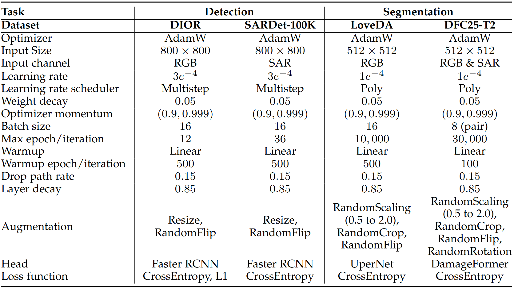

# CoDe-MAE for DFC25-T2 (BRIGHT dataset)

We use DamageFormer as bi-temporal segmentation pipeline. 

This task is based on [ChenHongruixuan/BRIGHT](https://github.com/ChenHongruixuan/BRIGHT).

Please follow [ChenHongruixuan/BRIGHT](https://github.com/ChenHongruixuan/BRIGHT) and [DFC25](https://www.grss-ieee.org/community/technical-committees/2025-ieee-grss-data-fusion-contest/) to download the dataset.

Detailed configurations of fine-tuning on dense prediction tasks.

  

The requirements for pretraining or detection would satisfy this task.

> **1. Usage**: See [ChenHongruixuan/BRIGHT](https://github.com/ChenHongruixuan/BRIGHT) for [train.py](train.py) and [inference.py](inference.py)

> **2. Checkpoints of CoDe-MAE**: See [benchmark_configs_weights](https://pan.baidu.com/s/1MNFYW0sU5Nkla67Aw0EL3g?pwd=vkpg)
