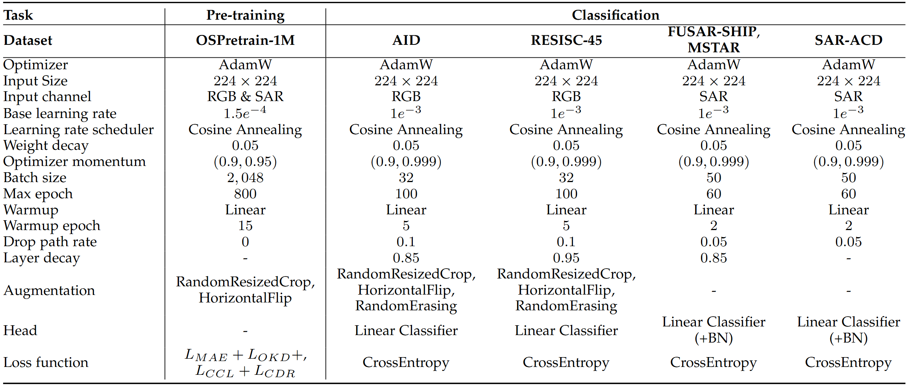

# CoDe-MAE Classification (fine-tune)

We mainly follow the evaluation protocols established in RingMo, SkySense, and SelectiveMAE for optical image classification on the AID and NWPU-RESISC45 datasets. Specifically, we use 20\% and 10\% of the data for training, respectively, with the remaining samples used for evaluation via OA. For SAR target classification evaluation, we follow the protocols established in SARATR-X, SARMAE, and SUMMIT. We conduct 40-shot full fine-tuning experiment on the FUSAR-SHIP, MSTAR, and SAR-ACD datasets. 

Detailed configurations of pre-training and fine-tuning on classification datasets.

  

## Requiments
* Python 3.8
* Pytorch/torchvision 2.0/0.15.1
* timm 0.3.2

> **1. Configurations**: See [run_trainings.py](run_trainings.py)

> **2. Logs**: See [./log_finetune](log_finetune)

